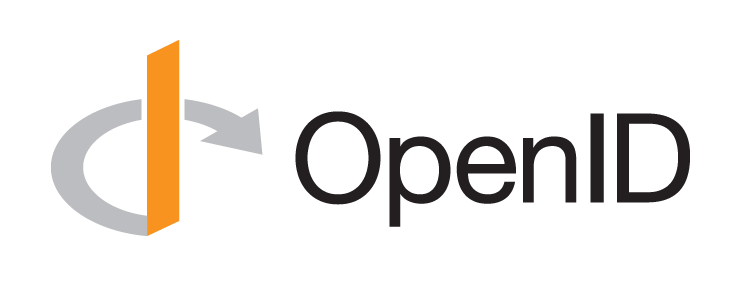

# Open ID Connect

- [Open ID Connect](#open-id-connect)
  - [Introduction](#introduction)
  - [Typical use case (Authorization Grant Flow)](#typical-use-case-authorization-grant-flow)
  - [The authorization code and tokens](#the-authorization-code-and-tokens)
  - [Adding OIDC authentication to your app](#adding-oidc-authentication-to-your-app)
  - [Create your own OP](#create-your-own-op)
  - [Links](#links)



When we develop web or mobile or apps, we may deal with the authentication of the users. Handling authentication on our own backend can prove complicated and risky because we are responsible of handling sensible data. Hopefully, there is a way to delegate authentication to an authentication server and is called OpenID Connect. This On top of that, it is a standard protocol that is well suited for mobile apps and web apps. This post serves as a modest introduction to this standard.

## Introduction

OpenID Connect, abbreviated OIDC, is a standard that allows to a program, application or website to identify a user thanks to an authentication server. It also allows to get basic authentication information.

OIDC does not define new protocols for every aspect of the identification. Instead, it relies on OAuth 2, which is a framework that defines how a user can get access to resources, and adds a layer that allows to identify the user and a to provide basic information about him.

(Identity, Authentication) + OAuth 2.0 = OpenID Connect

The next section explains a typical OIDC scenario.

## Typical use case (Authorization Grant Flow)

In this section, we give a typical use case for OIDC where we want to develop a mobile app that only retrieves user information and does communicate with its backend.

Suppose we want to develop a mobile app that allows its end-users to log-in using an OIDC provider (abbreviated OP) and shows basic user information retrieved from that OP. In OIDC terminology, the mobile-app is considered an OIDC client and is called Relying Party or RP. This use case flows as follows:

1. The RP requests the OP to authenticate the user
2. The OP shows a web view that asks the end-user to enter his credentials and validate the fact that he is going to provide authentication information to the RP
3. The OP validates back to the RP with an authorization code that gets exchanged with an Access Token and an ID Token. The RP notifies the end-user that the connexion is successful
4. The RP can request some user info from the RP using the access token

This type of flow is called _Authorization Code Flow_, and OIDC defines 2 other flows which as the _Implicit flow_ and _Hybrid flow_. This humble introduction focuses mainly on the _Authorization Code Flow_.

During the _Authorization Code Flow_, the RP sends these requests to the OP:

- The authorization request which that allows the OP to authenticate the end-user. Its result is an authorization code
- The token request that exchanges the authorization code for an access token, ID token and optionally a refresh token
- The user info request that takes the access token as input and returns information about the user

Each of these requests is called an endpoint. OIDC defines standard endpoints that every OP must provide. Every OP exposes its endpoints in the discovery url which is also part of the OIDC standard. It is a JSON file that contains the different endpoints as well as other information. The discovery allows a RP to dynamically obtain the relevant information about an OP. Here are some discovery urls that you can check right now:

- [Google](https://accounts.google.com/.well-known/openid-configuration)
- [Microsoft](https://login.microsoftonline.com/fabrikamb2c.onmicrosoft.com/v2.0/.well-known/openid-configuration)
- [Yahoo](https://login.yahoo.com/.well-known/openid-configuration)

Here is a snippet of the [Yahoo OIDC discovery](https://login.yahoo.com/.well-known/openid-configuration), where you can see the endpoints explained above:

```javascript
{
  "issuer": "https://api.login.yahoo.com",
  "authorization_endpoint": "https://api.login.yahoo.com/oauth2/request_auth",
  "token_endpoint": "https://api.login.yahoo.com/oauth2/get_token",
  "introspection_endpoint": "https://api.login.yahoo.com/oauth2/introspect",
  "userinfo_endpoint": "https://api.login.yahoo.com/openid/v1/userinfo",
  ...
}
```

At any time does the RP know about the end-user credentials. Instead, it gets an an authorization code and after that an access token and an ID Token. These are explained in the next section.

## The authorization code and tokens

The authorization code's only purpose is to exchange it with an access token and an ID token. It is used in the _Authorization Code Flow_ and other OIDC flows may skip it and directly return an the tokens.

## Adding OIDC authentication to your app

When we say that client app supports OIDC, it means that the app is a RP that can retrieve the different tokens. The token may be used to get user information or request other APIs as long as they support the access token as an input.

Thanks to the popularity of OIDC, we can fairly find SDKs that abstract many aspects for implementing an RP. For example, the AppAuth SDK for iOS and Android provides a simple interface for requesting endpoints and persisting authentication information. It also handles all interaction with the OP for us.

Here are some SDKs for impleting an OIDC client or RP:

- iOS and macOS: [AppAuth for iOS and macOS](https://github.com/openid/AppAuth-iOS)
- Android: [AppAuth for Android](https://github.com/openid/AppAuth-Android)
- Javascript: [AppAuth for JS]()
- Angular: [angular-auth-oidc-client](https://github.com/damienbod/angular-auth-oidc-client)

## Create your own OP

## Links

- [https://openid.net/connect/](https://openid.net/connect/)
- [List of public OpenID Connect providers](https://connect2id.com/products/nimbus-oauth-openid-connect-sdk/openid-connect-providers)
- [OpenID Connect (Authorization Code Flow) with Red Hat SSO](https://medium.com/@robert.broeckelmann/openid-connect-authorization-code-flow-with-red-hat-sso-d141dde4ed3f)
- [Execute an Authorization Code Grant Flow](https://auth0.com/docs/api-auth/tutorials/authorization-code-grant)
